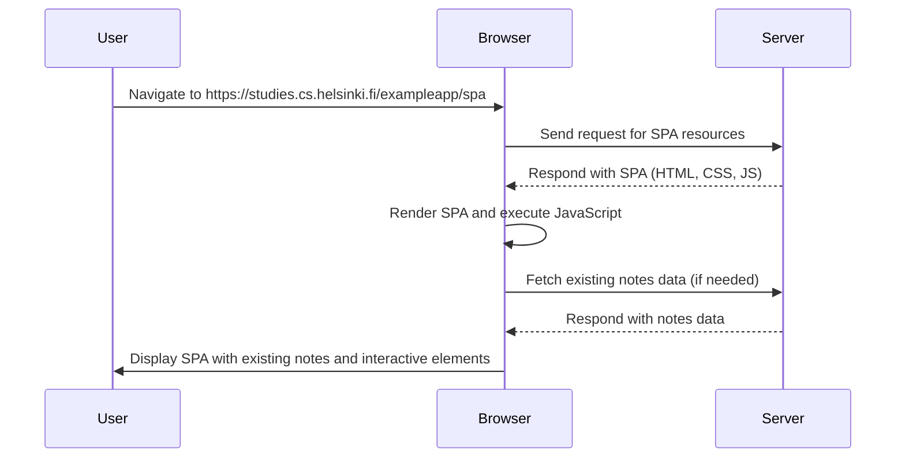

```mermaid
sequenceDiagram
    participant User
    participant Browser
    participant Server

    User->>Browser: Navigate to https://studies.cs.helsinki.fi/exampleapp/spa
    Browser->>Server: Send request for SPA resources
    Server-->>Browser: Respond with SPA (HTML, CSS, JS)
    Browser->>Browser: Render SPA and execute JavaScript
    Browser->>Server: Fetch existing notes data (if needed)
    Server-->>Browser: Respond with notes data
    Browser->>User: Display SPA with existing notes and interactive elements
```